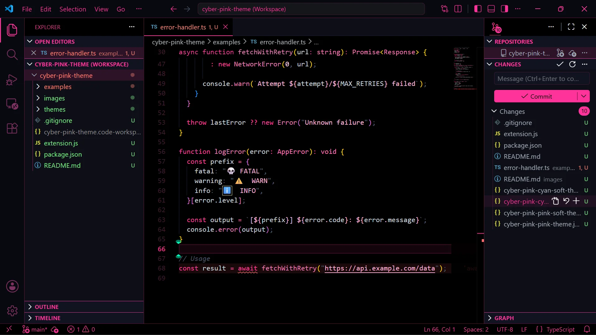
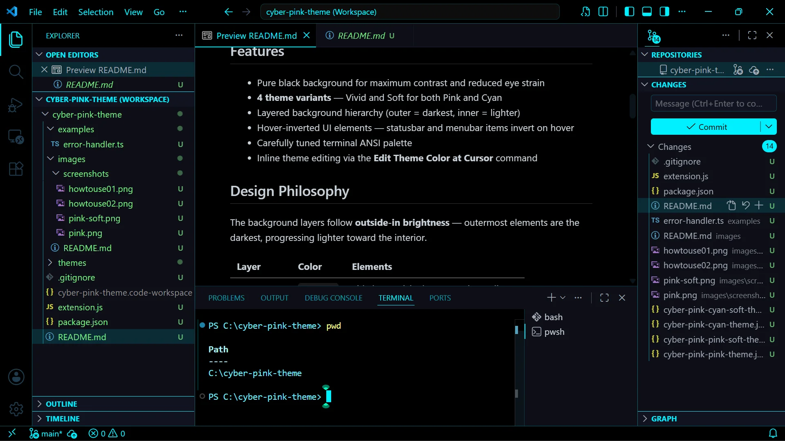
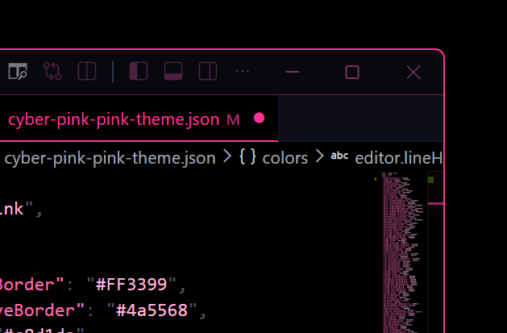

# Cyber Pink

A dark cyberpunk-inspired theme for Visual Studio Code with neon accents.

## Screenshots
*💗 CYBER PINK — Pink color*

*💙 CYBER PINK — Cyan color*






## Theme Variants

| Theme | Accent | Description |
|-------|--------|-------------|
| 💗 **Pink** | `#FF3399` | Vivid neon pink |
| 🌸 **Pink Soft** | `#D92B82` | Muted pink — softer glow for extended sessions |
| 💙 **Cyan** | `#00f0ff` | Vivid neon cyan |
| 🫧 **Cyan Soft** | `#00CCD9` | Muted cyan — softer glow for extended sessions |

## Features

- Pure black background for maximum contrast and reduced eye strain

- If the color is too intense, soften it. It will change slightly.

- **4 theme variants** — Vivid and Soft for both Pink and Cyan
- Layered background hierarchy (outer = darkest, inner = lighter)
- Hover-inverted UI elements — statusbar and menubar items invert on hover
- Carefully tuned terminal ANSI palette
- Inline theme editing via the **Edit Theme Color at Cursor** command

## Design Philosophy

The background layers follow **outside-in brightness** — outermost elements are the darkest, progressing lighter toward the interior.

| Layer | Color | Elements |
|-------|-------|----------|
| **Outermost** | `#000000` | Title bar, activity bar, status bar, editor |
| **Middle** | `#0d0e17` | Sidebar, panel, tab bar |
| **Inner** | `#111320` | Section headers, inputs, menus, widgets |

## Installation

### Local Install

1. Copy or clone this folder into your VS Code extensions directory:
   - **Windows**: `%USERPROFILE%\.vscode\extensions\`
   - **macOS/Linux**: `~/.vscode/extensions/`
2. Restart VS Code.
3. Open the Command Palette (`Ctrl+Shift+P` / `Cmd+Shift+P`) and run:
   ```
   Preferences: Color Theme
   ```
4. Select one of the **CYBER PINK** variants.

### Packaged Install (`.vsix`)

1. Package the extension with [vsce](https://github.com/microsoft/vscode-vsce):
   ```bash
   npx @vscode/vsce package
   ```
2. Install the generated `.vsix` from the Extensions view (`...` → **Install from VSIX...**).

## Commands

| Command | Title | Description |
|---------|-------|-------------|
| `cyberPink.editThemeColorAtCursor` | **Edit Theme Color at Cursor** | Detects the token type at the cursor and lets you edit its theme color directly. |
| `cyberPink.switchAccentPreset` | **Switch Accent Preset** | Quick-switch between accent color presets. |

Right-click in any editor and choose **Edit Theme Color at Cursor** to tweak token colors on the fly.

## Color Reference

### Accent Colors

| Variant | Primary | Light | Hover | Inactive |
|---------|---------|-------|-------|----------|
| **Pink** | `#FF3399` | `#FF69B4` | `#CC297A` | `#7d3060` |
| **Pink Soft** | `#D92B82` | `#D95999` | `#AD2368` | `#6A2952` |
| **Cyan** | `#00f0ff` | `#67e8f9` | `#00c3cc` | `#1e3a4d` |
| **Cyan Soft** | `#00CCD9` | `#58C5D4` | `#00A6AD` | `#1A3242` |

### Semantic Colors

| Role | Color | Usage |
|------|-------|-------|
| **Success** | `#7ee787` | Git added, debug restart |
| **Warning** | `#f1fa8c` | Warnings, overview ruler |
| **Danger** | `#ff6b6b` | Errors, deletions, debug stop |
| **Text** | `#c8d1da` | Primary foreground |
| **Muted** | `#4a5568` | Disabled, placeholder |

## Changelog

### 0.2.1
- Fixed theme colors (updated active window border color to cyber cyan)

### 0.2.0
- Added 4 theme variants: Pink, Pink Soft, Cyan, Cyan Soft
- Redesigned background hierarchy (outside-in brightness)
- Added hover-inverted UI for statusbar and menubar
- Added accent-colored borders for activity bar, title bar, status bar
- Improved list hover, input field, and terminal styling

### 0.1.0
- Initial release with dark cyberpunk color scheme
- Added Edit Theme Color at Cursor command

## License

MIT
